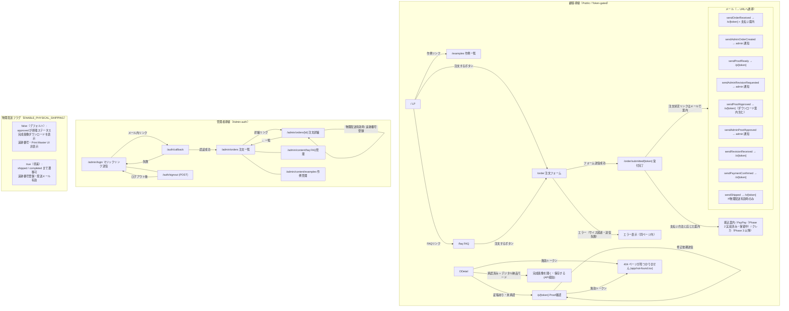

# 09_screen_transitions.md

> **更新ルール**: ルート・ナビゲーション・メールリンクが変わったら必ずこのファイルを更新する。
> 詳細は `CLAUDE.md` の「Screen-transition doc discipline」を参照。
> フックが `app/**/page.tsx` / `layout.tsx` / `route.ts` / `actions.ts` / `lib/email.ts` / `lib/auth.ts` の変更を検知し、
> このファイルが更新されていない場合は Stop 時にブロックする。

---

## アクセス区分の凡例

| 区分 | 説明 |
|------|------|
| **Public** | 誰でもアクセス可 |
| **Token-gated** | URL に埋め込まれたトークンで認証 |
| **Admin-auth** | Supabase magic-link 認証済みセッション必須 |

---

## 画面遷移図（Mermaid）

---

## ルート一覧

| パス | ファイル | アクセス区分 | 主な遷移先 |
|------|----------|------------|-----------|
| `/` | `app/page.tsx` | Public | `/order`, `/examples`, `/faq` |
| `/order` | `app/order/page.tsx` | Public | `/order/submitted/[token]`（送信後） |
| `/order/submitted/[token]` | `app/order/submitted/[token]/page.tsx` | Token-gated | 振込案内 / PayPay 案内（Phase 2 実装済み・保留中）、トップ |
| `/o/[token]` | `app/o/[token]/page.tsx` | Token-gated | `/p/[token]`（proof あり時）、`/api/storage/...`（承認後DL） |
| `/p/[token]` | `app/p/[token]/page.tsx` | Token-gated | 同ページ内で承認 / 修正依頼 |
| `/examples` | `app/examples/page.tsx` | Public | — |
| `/faq` | `app/faq/page.tsx` | Public | `/order` |
| `/admin` | `app/admin/page.tsx` | Admin-auth | `/admin/orders`（自動リダイレクト） |
| `/admin/login` | `app/admin/login/page.tsx` | Public | メール送信（magic link） |
| `/auth/callback` | `app/auth/callback/route.ts` | Public | `/admin/orders` or `/admin/login?error=...` |
| `/auth/signout` | `app/auth/signout/route.ts` | セッション任意 | `/admin/login` |
| `/admin/orders` | `app/admin/orders/page.tsx` | Admin-auth | `/admin/orders/[id]` |
| `/admin/orders/[id]` | `app/admin/orders/[id]/page.tsx` | Admin-auth | `/admin/orders`、外部メール |
| `/admin/content/faq` | `app/admin/content/faq/page.tsx` | Admin-auth | — |
| `/admin/content/examples` | `app/admin/content/examples/page.tsx` | Admin-auth | — |
| `/api/storage/[bucket]/[...path]` | `app/api/storage/[bucket]/[...path]/route.ts` | Token-gated or Admin-auth | 外部 Supabase signed URL（リダイレクト） |

---

## メール → URL マップ

| 関数 | トリガー | メール内リンク |
|------|---------|--------------|
| `sendOrderReceived` | 注文送信完了 | `/o/[public_order_token]` |
| `sendAdminOrderCreated` | 注文送信完了 | なし（admin 通知） |
| `sendProofReady` | admin が proof アップロード | `/p/[public_proof_token]` |
| `sendProofApproved` | 顧客が承認 | `/o/[public_order_token]`（+ DLページ案内） |
| `sendAdminProofApproved` | 顧客が承認 | なし（admin 通知） |
| `sendRevisionReceived` | 顧客が修正依頼 | `/o/[public_order_token]` |
| `sendAdminRevisionRequested` | 顧客が修正依頼 | なし（admin 通知） |
| `sendPaymentConfirmed` | admin が payment を `paid` に更新 | `/o/[public_order_token]` |
| `sendShipped` | admin が追跡番号登録 ※`ENABLE_PHYSICAL_SHIPPING=true` 時のみ | `/o/[public_order_token]` |

> **2026-05-01 更新**: メール本文・UI の納期表記を「5〜10 営業日」→「5 営業日以内」に変更。メール内リンク・ルートの変更なし。
> **2026-05-01 更新**: メールプロバイダを Resend → Brevo に変更。送信元・宛先ロジック・メール内リンク・ルートの変更なし。

---

## フィーチャーフラグ: `ENABLE_PHYSICAL_SHIPPING`

| 値 | 挙動 |
|----|------|
| `false`（デフォルト） | `approved` が終端ステータス。`/o/[token]` に完成画像ダウンロードリンクを表示。追跡番号入力・Print Master UI・`in_production`/`shipped`/`completed` ステータス非表示。 |
| `true` | 全ステータス遷移・追跡番号・Print Master・`sendShipped` メールがすべて有効。 |

`.env.local` の `ENABLE_PHYSICAL_SHIPPING=true` で切替可能。

---

## Future notes（memo, not a commitment）

このセクションは実装しない内容を含む。将来判断のための備忘録のみ。

- **デジタル納品の体験補強**: デジタル画像が MVP 主商品になるため、`/o/[token]` 承認後の体験品質（成功画面・保存方法ガイド・SNS シェア導線など）は将来見直し候補。今は実装しない
- **物理アップセル導線**: 物理商品を追加する場合、`/o/[token]` 承認後に「同じ画像でキャンバスを作る」等の導線を検討する案あり。その際はトークン引継ぎ（例: `/o/[token]/upsell`）を前提にする想定。**今は実装しない**
- **流入チャネル計測**: minne 等外部チャネルからの流入には現状追跡パラメータがない。中期で `acquisition_source` クエリを `orders` に保存する案あり。**今は実装しない**
